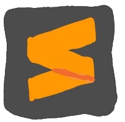

  

##  PHP Projects Collection
This repository encompasses a variety of PHP-based projects, plugins, and snippets. Each has been carefully crafted to address specific needs or to facilitate the PHP development process. The collection spans different categories including PHP plugins, custom snippets, and WordPress plugins.

##  About the Projects
This collection showcases the power and flexibility of PHP through a range of projects from simple scripts to complex web applications. Each project is designed to solve a specific problem or automate a process.

##  Features
* **PHP Plugins:** Various plugins designed to ease the general PHP development process.
* **Custom Snippets:** Customized code snippets to speed up coding and make the development process more efficient.
* **Placement Test:** Exam application that measures users foreign language levels.
* **WordPress Plugins:** Various plugins to customize and extend WordPress sites.
Usage
Under each project in this collection, you will find specific README files. These READMEs provide detailed information on how to use, install, and configure the projects.

##  Getting Started
Before using the projects, follow the prerequisites and installation steps mentioned in the README file of each project.

##  General Prerequisites
* PHP (Version recommendations may vary by project)
* MySQL or other database systems required by the project

##  Contact Information

You can reach out to me using the following contact details:

I'm always open to development and collaboration. Feel free to reach out to me!