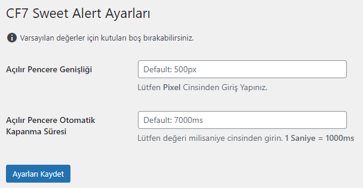

## Popup Message Notifier for Contact Form 7

```php
/**
 * @link         https://github.com/ozceliksinan
 * @since        1.0
 * @package      cf7_simple_popup
 * 
 * @wordpress-plugin
 *
 * Plugin Name:  Contact Form 7 Simple Popup
 * Plugin URI:   https://github.com/ozceliksinan
 * Description:  Contact Form 7 Simple Popup
 * Version:      1.0
 * Author:       Sinan Özçelik
 * Contributors: Sinan Özçelik
 * Author URI:   https://github.com/ozceliksinan
 * License:      GPL-3.0+
 * License URI:  http://www.gnu.org/licenses/gpl-3.0.txt
 * Requires PHP: 5.6
 * Tested up to: 6.4.1
 * Text Domain:  cf7simplepopup
 * Tags:         contact form 7, response message, popup message, popup confirmation, popup send, cf7, contact form 7, contact form seven, contact form popup, popup, popup contact form 7
 */
```

## Description

This plugin will show confirmation and error messages of CF7 inside a popup made with sweetalert2.

This plugin requires the Contact Form 7 plugin to work.



### Features of Popup Message Notifier for Contact Form 7

* No configuration is needed
* You can configure various option from the setting page such as popup width, popup automatic closing time.

Just activate it to replace CF7 default submission output by a Sweet Alert pop up. The add-on will display the Contact Form 7 messages in the pop up.

### How does it work?

It enqueues scripts and styles to override CF7 submission process and surcharge it with Sweet Alert scripts.

### Installation

You can install manually, follow these steps:

1. Upload the entire 'cf7-sweet-alert-popup' folder to the '/wp-content/plugins/' directory.
2. Activate the plugin through the 'Plugins' menu in WordPress admin.

### Changelog
* 1.0 - First release.